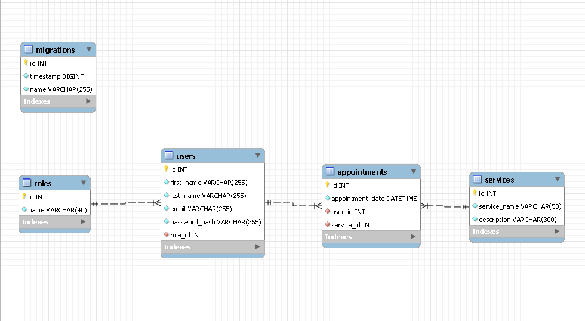

# Tattoo and piercing shop 

Hi Geeks! I have made a backend application based on a Tatto and piercing shop where you can register and login and more things explained below!

## Index 🧾
<details>

<summary> Index 🧾</summary>


- [Technologies ⚙](#technologies-)
- [Installation ⬇](#installation-)
- [Diagram](#diagram)
- [Endpoints](#endpoints)
- [Bugs 🐛](#bugs-)
- [Author 🙍‍♂️](#author-)
- [Time of development ⌛](#time-of-development-)

</details>

## Technologies ⚙


## Installation ⬇

<details>

<summary>Installation ⬇</summary>


***Enjoy yourself with this project in your local storage executing these commands in your terminal***

**1**

***Clone the repository***
```sh
git clone https://github.com/FRR95/Proyecto-API-Buscador-Backend-I.git
```
**2**

***Install all your dependencies***
```sh
npm install
```


**3**

***Create .env file based on .env.sample variables and add its proper values***

**4**

***Run the server***
```sh
npm run dev
```


**5**

***Craete all the tables on your database***

```sh
npm run run-migrations
```


**6**

***Create data for the tables***

```sh
npm run run-seeders
```

***You can rather execute the sql code in the sql directory in the proper order (Services.sql>Roles.sql>Users.sql>Appointments.sql) from strongest to weakest table***


**7**

***Revert the tables***

```sh
npm run revert-migrations
```


</details>

## Diagram



## Endpoints
<details>
<summary>Endpoints</summary>

***Add in your client the following endpoints***

***AUTH***

- REGISTER A USER

 ```sh
POST localhost:4000/api/auth/register
 ```
***body***

 ```sh
{
   "first_name":"the-firt-name",
   "last_name":"the-last-name",
   "email":"your-email",
   "password-hash":"your-password"
}
 ```
- LOGIN A USER

 ```sh
POST localhost:4000/api/auth/login
 ```
***body***

 ```sh
{
   "email":"your-email",
   "password-hash":"your-password"
}
 ```
  
***USER***      

- GET A USER

 ```sh
GET localhost:4000/api/users
 ```

 - GET YOUR USER PROFILE

 ```sh
GET localhost:4000/api/user/profile
 ```

  - UPDATE YOUR USER PROFILE

 ```sh
PUT localhost:4000/api/user/profile
 ```

 ***body***

 ```sh
{
   "first_name":"your-first-name"
}
 ```

   - DELETE A USER

 ```sh
DELETE localhost:4000/api/users/:id
 ```

 - UPDATE A USER ROLE

 ```sh
PUT localhost:4000/api/users/:id/role

 ```
***APPOINTMENTS***  

 - POST AN APPOINTMENT

 ```sh
POST localhost:4000/api/appointments
 ```

 ***body***

 ```sh
{
   "appointment_date":"your-appointment-date",
   "service_id":"service-id"
}
 ```
 - UPDATE AN APPOINTMENT

 ```sh
PUT localhost:4000/api/appointments
 ```

 ***body***

 ```sh
{
   "appointment_date":"your-appointment-date",
   "service_id":"service-id"
}
 ```
 - RECOVER AN APPOINTMENT

 ```sh
GET localhost:4000/api/appointments/:id
 ```

 - GET PROFILE APPOINTMENTS

 ```sh
GET localhost:4000/api/appointments
 ```

***SERVICES***  

 - GET SERVICES

 ```sh
GET localhost:4000/api/services
 ```

  - POST A SERVICE

 ```sh
POST localhost:4000/api/services
 ```

 ***body***

 ```sh
{
   "service_name":"service-name",
   "description":"service-description"
}
 ```
  - UPDATE A SERVICE

 ```sh
PUT localhost:4000/api/services/:id
 ```

 ***body***

 ```sh
{
   "service_name":"service-name"
}
 ```

   - DELETE A SERVICE

 ```sh
DELETE localhost:4000/api/services/:id
 ```

***🚩CAUTION:In some endpoints you need to be register and or with super_admin privileges showed as auth and isSuperAdmin middleware on the end points***

***header***
```sh
your-token-here
```
</details>

## Bugs 🐛

**When i run the seeders an error appears and says:**
```sh
throw new CannotExecuteNotConnectedError(this.name)
                  ^
CannotExecuteNotConnectedError: Cannot execute operation on "default" connection because connection is not yet established.
```

**The connection is stablished and the seeder is succesfully executed anyway despite the error**

## Author 🙍‍♂️

- **Francisco Rocher Roure** - FullStack Developer
  - [GitHub](https://github.com/FRR95) - [LinkedIn](https://www.linkedin.com/in/franciscorocher/) - [Portfolio](https://franciscorocherdev.com/)


## Time of development ⌛

- One Week